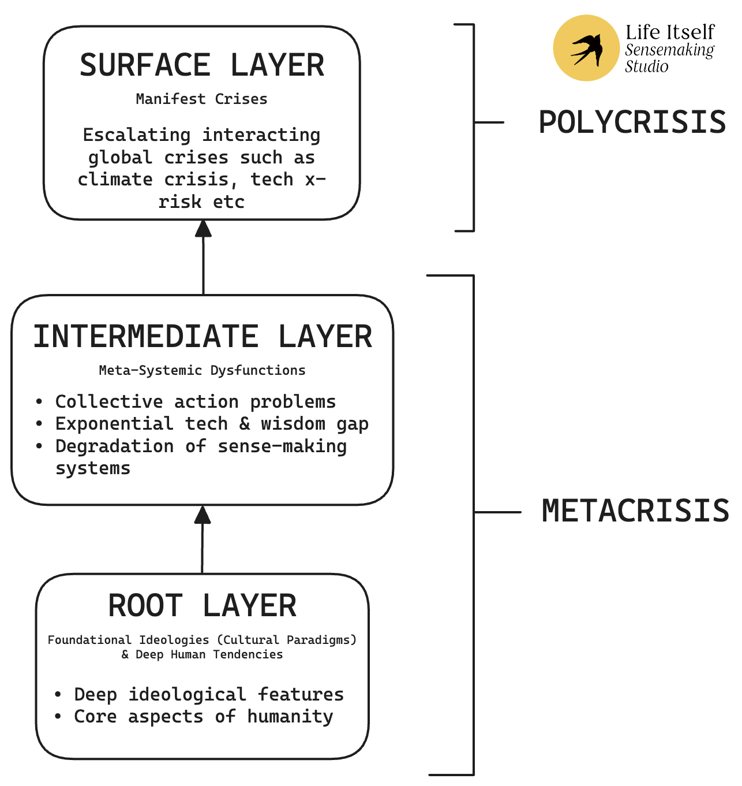

We're happy to announce the release of a draft version of a new white paper: “From Polycrisis to Metacrisis: a short introduction”.

<a href="https://drive.google.com/file/d/1aVI5vJcHmSidj_jJBfE4tx5g1Q1-cXLh/view" class="inline-block bg-blue-600 text-white font-bold text-lg px-8 py-3 rounded-lg shadow-xl hover:bg-blue-700 transition-colors mt-4 mb-8">Download the White Paper →</a>

UPDATE: Sep 2025. We have released a short video of a presentation of these ideas in June 2025.

<a href="https://drive.google.com/file/d/1aVI5vJcHmSidj_jJBfE4tx5g1Q1-cXLh/view" class="inline-block bg-blue-600 text-white font-bold text-lg px-8 py-3 rounded-lg shadow-xl hover:bg-blue-700 transition-colors mt-4 mb-8"> Download the White Paper →
</a>

Our world shows signs of multi-systemic breakdown. In this context, polycrisis names an entanglement of interconnected crises that affect one another. Metacrisis, by contrast, identifies foundational conditions that generate these crises.

A metacrisis is a crisis at the “meta” layers of civilization, and especially at the cultural base.

This paper offers an accessible introduction to the polycrisis and metacrisis: what they are, how they are distinct, how they are related and why it matters. Short case studies demonstrate the polycrisis-metacrisis frame as applied to three real-world issues: climate breakdown, runaway AI and populism.

This is the third whitepaper in the Second Renaissance series. Authored by two members of the Life Itself Sensemaking Studio, Rosie Bell and Rufus Pollock, it was created with the support of Commonweal to whom we are very grateful. Thanks also to members of Life Itself Research for their comments and review on early drafts, and the scholars of the wider sensemaking community whose foundational work on metacrisis informs this synthesis.

## Summary

Our world shows signs of multi-systemic breakdown. In this context, polycrisis names an entanglement of interconnected crises that affect one another. Metacrisis, by contrast, identifies foundational conditions that generate these crises. Just as symptoms signal an underlying illness, polycrisis points to metacrisis. While the reality of a global polycrisis is increasingly acknowledged, awareness of metacrisis is less common.

Noticing the interactions between our symptoms is an important first step towards addressing them. However, deeper diagnosis of an issue is vital to effective strategies for healing. This essay investigates how dominant worldviews, particularly within a dominant cultural paradigm of modernity, lie at the root of systemic failures — and offers a number of case studies for rethinking polycrisis as symptoms of metacrisis.

Within a metacrisis frame, the deep stories foundational to our modern worldview shape our ways of relating to self and world, in ways that produce dysfunction.

## Polycrisis to Metacrisis: three layers

Fig 1: A simplified schematic logic of the relationship of polycrisis to metacrisis.

The symptoms of polycrisis share common roots in the meta layers of our civilizational systems and worldviews. Scholars of the metacrisis identify its features among the lower two layers depicted here. We emphasise primary causes in the bottom layer: in deep-seated human tendencies and foundational ideologies.

Even ‘meta’ issues such as collective action problems can be understood as symptoms of deeper causes - contingent on a fundamental worldview.

While polycrisis can be perceived in manifest forms from climate breakdown to inequality and more, metacrisis itself can be more difficult to see: we commonly mistake the core ideas of modernity for reality itself. As such, adopting the frame of metacrisis requires more than learning new facts. Typically, this is not the kind of change that occurs only because we learned new facts, but results from some experience, practice or lifestyle shift that has loosened our earlier way of looking…
